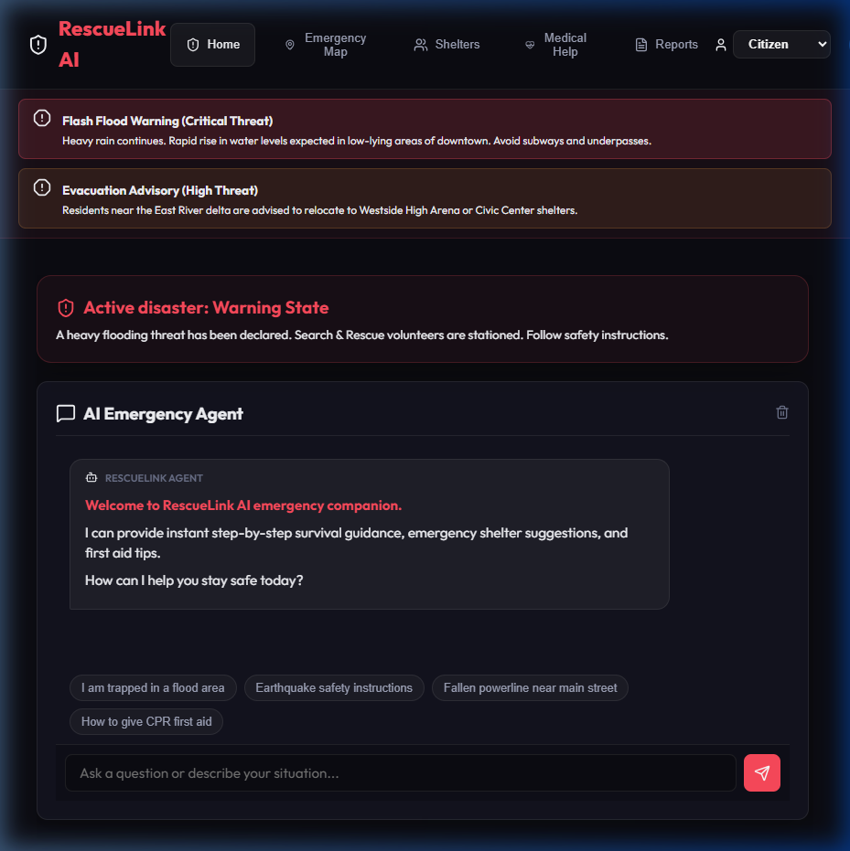
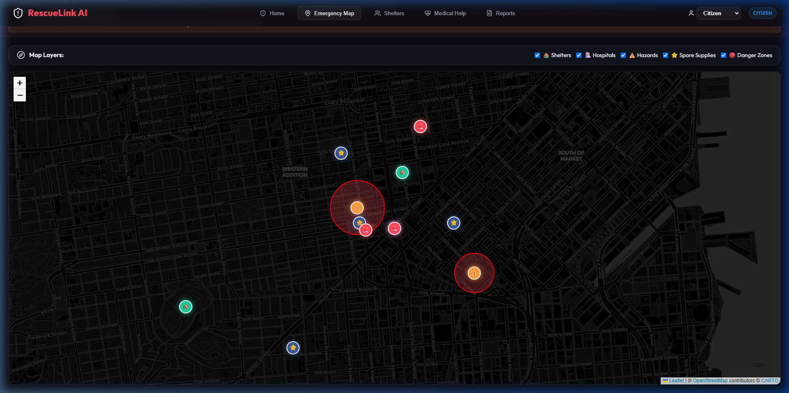

# RescueLink AI: Community Emergency Support Agent

**Track**: Agents for Good  
**Project Objective**: Build a fully functional, premium full-stack emergency response and disaster management platform to assist citizens, coordinate volunteers, and enable admin monitoring during crises.

RescueLink AI functions as an intelligent emergency companion providing safe routing detours around flood/fire zones, voice alert broadcasts for visually impaired/elderly accessibility, citizen surplus resource sharing, automated volunteer matching, and offline synchronization queues.

---

## 🛠️ Technology Stack & Architecture

RescueLink AI is built using a modern full-stack decoupled architecture:

### Frontend (Client)
- **Framework**: React.js (bootstrapped with Vite)
- **Styling**: Premium Vanilla CSS custom variables, featuring glassmorphism cards, responsive layouts, neon threat indicators, and pulsing SOS animation frames.
- **Mapping**: OpenStreetMap tiles styled and rendered interactively via Leaflet.js (`react-leaflet`).
- **Icons**: SVG vectors using `lucide-react`.
- **Accessibility**: Native Web Speech API (`window.speechSynthesis`) to broadcast critical emergency warnings aloud.

### Backend (Server)
- **Runtime**: Node.js with Express.js REST endpoints.
- **Database**: Lightweight JSON collection manager (`server/src/db.js`) that persists data locally to a file. Requires **zero** database engine setup.
- **AI Engine**: Direct REST calls to Google Gemini API (`gemini-1.5-flash`) when configured, backed by a local safety rule-based regex parser fallback.

---

## 📂 Project Directory Layout

```
rescue-link-ai/
├── package.json                 # Installs concurrently & scripts
├── README.md                    # Startup playbook (this file)
├── index.html                   # Entry page with SEO tags
├── vite.config.js               # Vite configurations
├── src/                         # Frontend React Source
│   ├── main.jsx                 # Mounts app & Leaflet styles
│   ├── index.css                # Premium Dark Mode Glassmorphic stylesheet
│   ├── App.jsx                  # Main view coordinator & state poller
│   ├── components/              # Modular UI Components
│   │   ├── Navbar.jsx           # Global Nav & Role Selector
│   │   ├── MapDashboard.jsx     # Leaflet map & AI safe routing bypass
│   │   ├── AIChatBot.jsx        # Conversational agent & quick prompts
│   │   ├── SOSButton.jsx        # Pulsing SOS beacon & status timeline
│   │   ├── ShelterFinder.jsx    # Shelter catalog & resource monitors
│   │   ├── MedicalGuide.jsx     # First aid instructions & triage
│   │   ├── ReportForm.jsx       # Citizen hazard reporting
│   │   ├── ShareSuppliesForm.jsx# Citizen surplus supplies sharing
│   │   ├── MissingPersons.jsx   # Missing directory & descriptor matching
│   │   └── AnalyticsView.jsx    # SVG metrics charts & depot levels
│   └── views/                   # Specialized workspace views
└── server/                      # Node.js Express Backend
    ├── package.json             # Server metadata
    ├── .env                     # Port configuration
    └── src/
        ├── index.js             # Express app routers & simulator triggers
        ├── db.js                # Database collection CRUD manager
        └── services/
            └── gemini.js        # Gemini fetch client & rules parser
```

---

## 🚀 How to Run Locally

You can launch both the frontend client and backend server concurrently with a single command:

### 1. Install Workspace Dependencies
Run this in the root directory `rescue-link-ai/` to install all React, Vite, Leaflet, and backend Express dependencies:
```bash
npm install
```

### 2. Startup Server & Client Concurrently
Boot up the development environments together:
```bash
npm run dev
```

The terminal will launch:
* **Frontend Web Client**: [http://localhost:5173](http://localhost:5173)
* **Backend REST API**: [http://localhost:5000](http://localhost:5000)

*(Optional: Add your `GEMINI_API_KEY=your_key` in `server/.env` to enable live LLM chat generation. If left blank, our rule-based expert safety engine will provide instructions.)*

---

## 🎮 Hackathon Demonstration Playbook

Test the full-stack coordination by switching roles in the top-right navbar dropdown:

### 1. The Citizen Emergency Journey
1. Open the web app at [http://localhost:5173](http://localhost:5173).
2. **AI Companion**: In the chatbot, click the quick prompt **"I am trapped in a flood area"**. The agent returns evacuation advice, recommends the closest active shelter (*Dharavi Town Hall Shelter*), and logs emergency phone lines.
3. **Pulsing SOS**: Click the large red **SOS button** (fill out name, phone, and group size). Your browser logs your coordinates. The tracker timeline enters **Waiting for Rescue**.
4. **Interactive Map**: Go to the **Emergency Map** tab. Check the pulsing blue coordinate pointer, red hazard zones, and shelters.
5. **AI Safe Routing**: Click the green **Dharavi Town Hall Shelter** marker, then click **Find Safe Route**. The AI route planner draws a dotted path bypassing active flood regions.

### 2. Community Cooperation
1. Click **Reports** in the navbar.
2. **Report Hazards**: Log a blocked lane (e.g. title: *"Blocked road - fallen powerline"*, category: *Unsafe areas*, click **Get GPS**, and submit). The hazard immediately registers on the map as an orange triangle.
3. **Share Supplies**: Fill in the **Share Surplus Supplies** card (e.g., name: *"Rakesh Kumar"*, item: *Blankets*, quantity: *15*). The item registers as a blue star marker on the live map.
4. **Missing Directory**: Search for *"Ramesh"* in the missing persons card to test character search filters.

### 3. The Volunteer Rescue Loop
1. Switch your role to **Volunteer** in the top-right navbar.
2. In the profile dropdown, select **Vikram Singh (Available)**.
3. Observe **Pending SOS Signals** listing your previously created citizen SOS.
4. Click **Claim Mission**. Vikram's status becomes "On Mission", and the SOS indicator transitions to **Help Assigned**.
5. Switch the navbar back to **Citizen**. Observe that the citizen's SOS timeline has automatically advanced to **Help Assigned** and lists Vikram as their responder!

### 4. Admin Command Console & Disaster Simulator
1. Switch your role to **Admin**. The **Admin Console** tab will appear.
2. **Alert warnings**: Click **Broadcast Warnings**, enter *"Evacuation Order: Mithi River Banks"* with Critical severity, and click **Dispatch**. Toggle back to Citizen view to observe the red alert banner spanning the screen, and listen as the **AI Voice Alert** reads it aloud!
3. **Disaster Simulator**: Click the **Disaster Simulator** tab, select *Fire*, input coordinates (e.g., lat: `19.0760`, lng: `72.8777`), and click **Inject Simulated Disaster**. This automatically creates danger zone circular overlays on the map and broadcasts evacuation alerts.
4. **Manage Supplies**: Under **Shared Supplies**, click **Claim/Dispatch** to claim community-offered resources once dispatched.
5. **Live Analytics**: Open the **Live Analytics** tab to view custom SVG charts plotting incident categories, depot supplies, and rescue completion rates.

---

## 📸 Local Session Visuals

Here are some screenshots and video walk-throughs captured during local execution:

### 1. Dashboard Loaded


### 2. AI Companion responding in Hindi / English with Local Fallbacks


### 3. Mumbai-centered Map with Danger Zones & Safe Bypass Route


### 4. Video Demonstration (Walkthrough)

