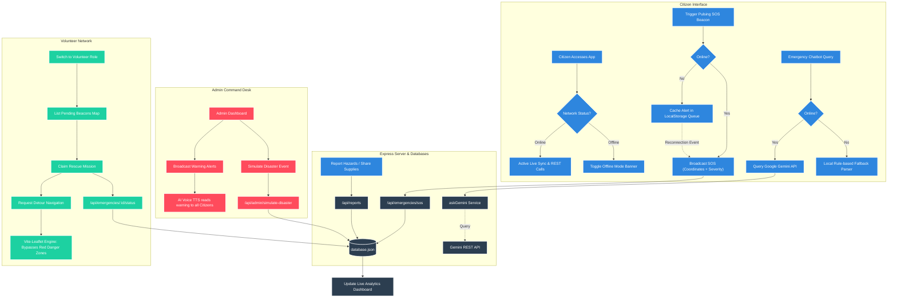

# RescueLink AI: Community Emergency Support Agent

**Track**: Agents for Good  
**Target Region**: Mumbai, Maharashtra, India  

RescueLink AI is a complete, full-stack emergency response and disaster management application designed to assist citizens, coordinate volunteers, and enable administrative supervision during crises (such as flooding, earthquakes, fires, cyclones, and landslides).

---

## 🛠️ System Architecture

RescueLink AI leverages a decoupled client-server architecture built on modern web standards:

```
+--------------------------------------------------------------+
|                    FRONTEND CLIENT (React)                   |
|  - Leaflet.js Mapping  - TTS Voice Alerts  - SOS Beacon      |
|  - Offline Caching     - Custom Dark Glassmorphic Theme      |
+--------------------------------------------------------------+
                               |
                               |  HTTP REST / API Calls
                               v
+--------------------------------------------------------------+
|                   BACKEND SERVER (Express.js)                |
|  - REST API Routing    - Fallback Regex Parser               |
|  - Gemini AI Client    - Local JSON DB File Seeder           |
+--------------------------------------------------------------+
                               |
                               +---> Local DB: database.json
```

---

## 🗺️ System Flow Diagram

The flowchart below visualizes the integration between the Citizen client interface, the local storage caching layers, the Node.js API server, the fallback rules-engine, and the volunteer response loops:



---

## 🚀 Key Features Detailed

### 1. Indian Context Localization (Mumbai)
- **Mapping Center**: OpenStreetMap defaults to Bandra Kurla Complex (BKC), Mumbai (`19.0760, 72.8777`).
- **Emergency Helplines**: Built-in direct link helplines for National Emergency (`112`), NDRF (`1078`), and Ambulance (`108` / `102`).
- **Shelters & Venues**: Real-world mock locations such as *Dharavi Town Hall Shelter*, *Bandra Sports Complex*, *Dadar Temple Community Hall*, and *Kurla Station Relief Camp*.
- **Danger Zones**: Pre-loaded flood warning parameters near the *Mithi River (Kurla)* and live powerline failures in *Sion*.

### 2. AI Safe Detour Routing
- Evaluates routes between citizens, shelters, and hospitals (*KEM Hospital*, *Lilavati Medical Center*).
- If the direct path crosses any active red **Danger Zone** (e.g. active flood boundary), the algorithm plots intermediate offsets to detour around hazards.

### 3. Accessible Speech Warnings (TTS)
- Broadcasts critical alerts (Critical/High severity) out loud using the web browser's native **SpeechSynthesis API**.
- Assists visually impaired, elderly, and distracted citizens during panic-inducing events.

### 4. Offline Synchronization
- Detects browser disconnects immediately, rendering an offline UI banner.
- Queues emergency SOS signals locally inside `localStorage` and automatically syncs them to the backend server the instant network connectivity is restored.

### 5. Community Supply Sharing Portal
- Enables citizens to register surplus rescue materials (blankets, water purifiers, transport trucks) on the live map.
- Volunteers and Admins can coordinate pickup locations and claim them once gathered.
